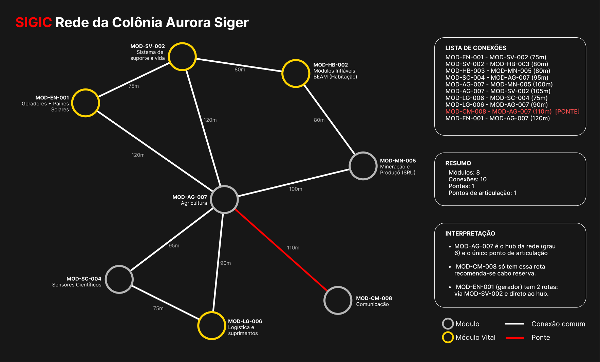

<div align="center">

# Sistema Inteligente de Gerenciamento da Infraestrutura da Colônia
**Colônia Aurora Siger · Fase 4 — Energia para Sobreviver**


</div>

---

## O que é o SIGIC?

O SIGIC representa computacionalmente a infraestrutura de uma base marciana como um **grafo não direcionado e ponderado** e otimiza sua rede energética usando algoritmos de grafos, modelagem matemática e governança ESG.

Desenvolvido inteiramente com a **biblioteca padrão do Python 3** — sem nenhuma dependência externa.

---
## Equipe

| Integrante | RM |
|------------|-----|
| Isabelle Caroline de Camargo Francisco | 572096 |
| Matheus Lyncoln Souza Dias | 570765 |
| Mirela Aparecida Bispo Miguel | 570830 |
| Rodrigo Abrantes Mizerani | 571808 |

---

## Início rápido

```bash
# Clone ou extraia o projeto e execute:
python codigo_fonte.py

# Windows
py codigo_fonte.py
```

O sistema abre um menu interativo no terminal. Sem instalação, sem pip, sem nada.

---

## Menu do sistema

```
╔══════════════════════════════════════════════════════╗
║           SIGIC — Colônia Aurora Siger               ║
╠══════════════════════════════════════════════════════╣
║  1. Visualizar a rede da colônia                     ║
║  2. Consultar um módulo                              ║
║  3. Caminho mínimo de energia      [Dijkstra]        ║
║  4. Explorar a rede                [BFS / DFS]       ║
║  5. Conexões críticas              [Pontes]          ║
║  6. Análise de eficiência operacional                ║
║  7. Modelagem matemática e otimização                ║
║  8. Simulações operacionais                          ║
║  0. Sair                                             ║
╚══════════════════════════════════════════════════════╝
```

---

## A rede da colônia




| Métrica | Valor |
|--------|-------|
| Módulos (vértices) | 8 |
| Conexões (arestas) | 10 |
| Consumo total | 475 kW |
| Reserva total | 2.410 kWh |
| Autonomia global | ~5,1 h |
| Hub da rede | MOD-AG-007 (6 conexões) |
| Ponte crítica | MOD-CM-008 ↔ MOD-AG-007 (110 m) |
| Ponto de articulação | MOD-AG-007 |
| Densidade | 0,357 |
| Caminho médio | 169,5 m |
| Diâmetro | 290 m (HB-003 → CM-008) |

---

## Algoritmos

### BFS — Busca em Largura
Explora a rede nível a nível a partir de qualquer módulo. Útil para verificar conectividade e calcular saltos mínimos.
```
A partir de MOD-EN-001:
N0 { MOD-EN-001 }
N1 { MOD-AG-007, MOD-SV-002 }
N2 { MOD-CM-008, MOD-LG-006, MOD-MN-005, MOD-SC-004, MOD-HB-003 }
```

### DFS — Busca em Profundidade
Mergulha em um ramo até o fim antes de retroceder. Usa pilha (append/pop).
```
MOD-EN-001 → MOD-AG-007 → MOD-CM-008 → MOD-LG-006 → MOD-SC-004 → MOD-MN-005 → MOD-HB-003 → MOD-SV-002
```

### Dijkstra — Caminho Mínimo
Calcula a rota de menor distância (= menor perda energética) entre qualquer par de módulos. Complexidade O(V²).
```
Rota MOD-EN-001 → MOD-CM-008:  MOD-EN-001 ──120m──► MOD-AG-007 ──110m──► MOD-CM-008
Distância total: 230 m | Perda: 6,90% | Entregue: 93,10%
```

### Detecção de Pontes e Articulações
Remove cada aresta/vértice e verifica via BFS se a rede se fragmenta.
```
Ponte:              MOD-CM-008 ↔ MOD-AG-007  (110 m)
Ponto articulação:  MOD-AG-007
```

---

## Simulações

**Distribuição com perdas**
Calcula a eficiência energética em cada rota ótima.
Coeficiente de perda: 0,0003 por metro de cabo.

```
MOD-EN-001 → MOD-SV-002 :   75 m  |  perda  2,25%  |  entregue 97,75%
MOD-EN-001 → MOD-AG-007 :  120 m  |  perda  3,60%  |  entregue 96,40%
MOD-EN-001 → MOD-HB-003 :  155 m  |  perda  4,65%  |  entregue 95,35%
MOD-EN-001 → MOD-LG-006 :  210 m  |  perda  6,30%  |  entregue 93,70%
MOD-EN-001 → MOD-SC-004 :  215 m  |  perda  6,45%  |  entregue 93,55%
MOD-EN-001 → MOD-MN-005 :  220 m  |  perda  6,60%  |  entregue 93,40%
MOD-EN-001 → MOD-CM-008 :  230 m  |  perda  6,90%  |  entregue 93,10%

Perda média: ~5,2%
```

**Priorização em blecaute**
Busca exaustiva entre 2⁸ = 256 combinações para manter os sistemas mais críticos ligados.
```
Energia disponível: 250 kW
✔ Ligados   : MOD-EN-001 + MOD-SV-002 + MOD-HB-003 + MOD-LG-006  →  235 kW
✘ Desligados: MOD-SC-004, MOD-MN-005, MOD-AG-007, MOD-CM-008
Todos os módulos de prioridade 5 foram preservados.
```

**Falha de conexão**
Simula a remoção de qualquer cabo e analisa o impacto na conectividade da rede.

---

## Modelagem matemática

Crescimento do consumo modelado pela **função logística (sigmoide)**:

```
         K                          K  = 1.200 kW  (capacidade máxima)
E(t) = ─────────────    onde:       E₀ =   120 kW  (consumo inicial)
       1 + A·e^(−rt)               r  =  0,15 /mês
                                   A  =  9,00
```

```
Ponto de inflexão  →  t* = 14,6 meses  (E = 600 kW, taxa = 45 kW/mês)
Consumo atual      →  475 kW  ≈  40% de K
90% da capacidade  →  atingido em ~29,3 meses
```

---

## Estrutura de arquivos

```
entrega/
├── codigo_fonte.py                   # sistema principal — execute aqui
├── arquivos_auxiliares/
│   ├── dados_colonia.json            # única fonte de dados da colônia
│   └── README.txt
├── rede_colonia.pdf                  # diagrama visual da rede
├── documentacao_complementar.pdf     # documentação técnica completa
└── link_video.txt                    # link do vídeo (YouTube · Não listado)
```

> Para modificar a colônia (módulos, conexões, pesos), edite apenas o `dados_colonia.json`.
> O sistema carrega os dados automaticamente ao iniciar.

---

## Conceitos aplicados

`Grafos` `BFS` `DFS` `Dijkstra` `Matriz de adjacência` `Lista de adjacência`
`Listas` `Tuplas` `Dicionários` `Matrizes` `Modelagem logística`
`Cálculo diferencial` `Otimização combinatória` `Smart Grids` `Governança ESG`

<div align="center">
<sub>FIAP · Fase 4 — Energia para Sobreviver · Colônia Aurora Siger</sub>
</div>
